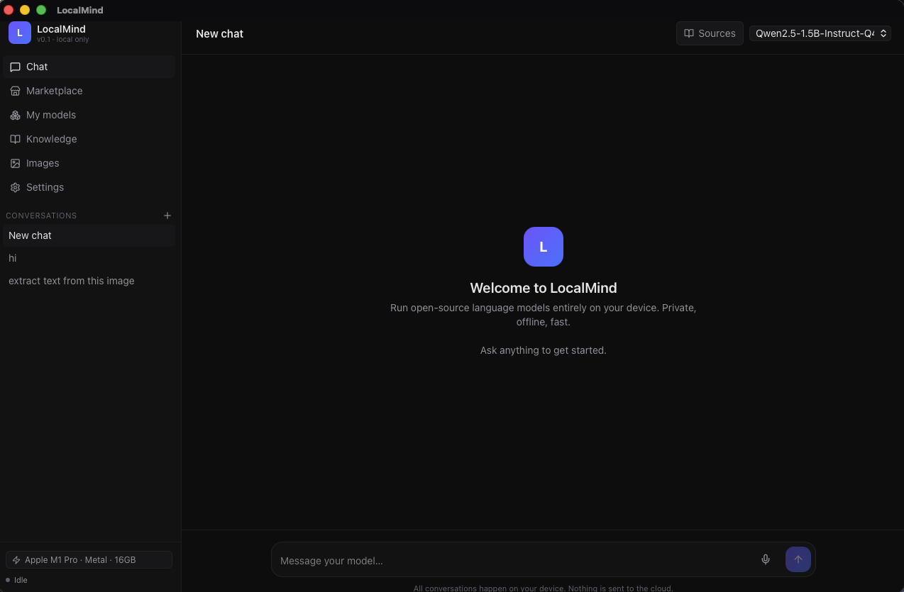
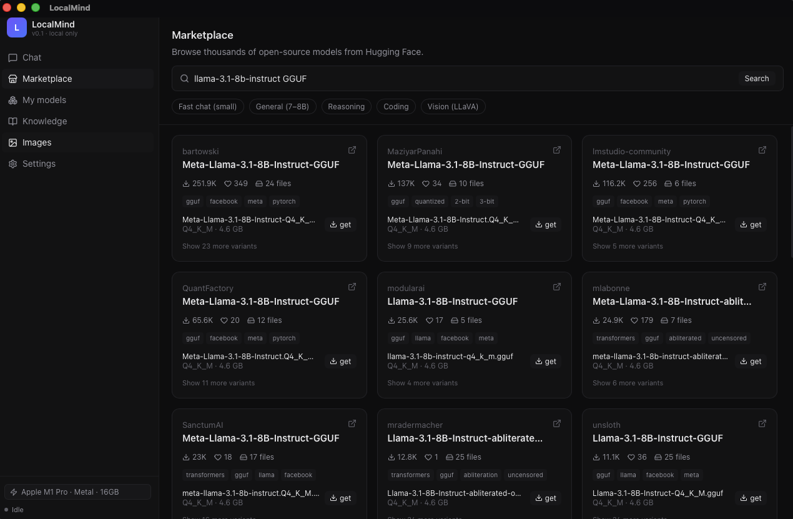

<div align="center">


# LocalMind

**Run open-source LLMs entirely on your device. Bring the chat to your phone over your home Wi-Fi.**

[](LICENSE)
[](https://tauri.app)
[](https://react.dev)
[](https://github.com/ggerganov/llama.cpp)
[](CONTRIBUTING.md)

[Quickstart](#quickstart) · [Features](#features) · [Synapse](#synapse--pool-machines-on-your-lan) · [Architecture](#architecture) · [Contributing](CONTRIBUTING.md) · [Roadmap](#roadmap)

</div>

---

LocalMind is a desktop app that runs open-source language models locally and exposes them as a chat UI you can open in a browser **or install on your phone as a PWA**, all on your private Wi-Fi. Models, conversations, documents, and images never leave your machine.

> **Status:** v0.1, actively developed. Mac (Apple Silicon) is the most-tested platform; Linux/Windows builds compile but receive less testing. Help wanted!

## Features

- 🧠 **Local chat** — streaming responses from any GGUF model via [llama.cpp](https://github.com/ggerganov/llama.cpp). Auto-detects Metal / CUDA / Vulkan and picks the right backend.
- 🛒 **Built-in marketplace** — search and one-click download GGUF models from Hugging Face directly in-app. Models too big for one machine get a **Needs Synapse** badge with a link to the cluster setup.
- 📚 **RAG over your docs** — drop PDFs / text into the Knowledge tab, get citations alongside answers (uses `nomic-embed-text` by default).
- 👁️ **Vision** — bring your own LLaVA / vision-language model + projector, attach images in chat.
- 🎨 **Image generation** — bundled `stable-diffusion.cpp`; generate locally with FLUX / SD models.
- 🎙️ **Voice** — Web Speech API for input and TTS playback. No cloud round-trip.
- 🕸️ **Synapse — pool LAN machines** — run models that don't fit on one device by pipeline-sharding layers across multiple computers on your Wi-Fi. Auto-discovery (mDNS + UDP beacon fallback), token-gated auth proxy, HMAC-signed beacons, live tok/s + per-worker RTT, manual layer-split sliders. See [Synapse](#synapse--pool-machines-on-your-lan).
- 📱 **Phone PWA** — pair an iPhone or Android with a 6-digit PIN, "Add to Home Screen", chat with the model running on your computer from anywhere on your Wi-Fi.
- 🔒 **Private by default** — embedded Axum LAN server only listens on your local network and requires a paired bearer token for any API call. Synapse workers reject any client without the per-worker token.

## Screenshots

| Chat | Marketplace |
|------|-------------|
|  |  |

## Install

Grab a prebuilt installer from the [Releases page](https://github.com/s-suryakiran/LocalMind/releases) — no toolchain required:

| Platform | File |
|---|---|
| Windows | `LocalMind_<version>_x64-setup.exe` (NSIS installer) |
| macOS (Apple Silicon) | `LocalMind_<version>_aarch64.dmg` |
| Linux | `localmind_<version>_amd64.deb` / `LocalMind_<version>_amd64.AppImage` |
| Android (preview) | `LocalMind_<version>_android-debug.apk` |

> **macOS:** these builds are not yet code-signed. After dragging `LocalMind.app` to Applications you may see *"LocalMind is damaged and can't be opened"* — that's macOS Gatekeeper quarantining unsigned downloads, **not** actual corruption. Strip the quarantine attribute once and it will open normally:
>
> ```bash
> xattr -cr /Applications/LocalMind.app
> ```
>
> **Windows:** SmartScreen may show *"Windows protected your PC"* on first launch — click **More info** → **Run anyway**. Both warnings will go away once we add code-signing.

Or [build from source](#quickstart) if you'd rather hack on it.

## Quickstart

### Prerequisites

| Requirement | macOS | Linux | Windows |
|---|---|---|---|
| Node.js 18+ | `brew install node` | distro pkg | [nodejs.org](https://nodejs.org/) |
| Rust (stable) | [rustup.rs](https://rustup.rs) | [rustup.rs](https://rustup.rs) | [rustup.rs](https://rustup.rs) |
| Xcode CLT | `xcode-select --install` | — | — |
| VS C++ Build Tools | — | — | [see below](#windows-note-vs-build-tools) |
| WebView2 | — | — | preinstalled on Win 11 |
| webkit2gtk | — | distro pkg | — |

llama.cpp itself is downloaded automatically on first model load — no manual setup.

#### Windows note: VS Build Tools

Rust on Windows uses the MSVC toolchain, which requires the **Visual Studio C++ Build Tools**. Install them before running `npm run tauri dev`:

```powershell
winget install Microsoft.VisualStudio.2022.BuildTools --override "--add Microsoft.VisualStudio.Workload.VCTools --includeRecommended --passive"
```

Alternatively, download the installer from [visualstudio.microsoft.com/visual-cpp-build-tools](https://visualstudio.microsoft.com/visual-cpp-build-tools/) and select the **"Desktop development with C++"** workload. Restart your terminal after installation.

### Run in development

```bash
git clone https://github.com/s-suryakiran/LocalMind.git
cd LocalMind
npm install
npm run tauri dev
```

The Tauri window opens with a hardware probe and a Marketplace tab to grab a model. Try `qwen2.5-7b-instruct GGUF` for a sensible starter.

### Build a release bundle

```bash
npm run tauri build
```

Outputs platform-native installers under `src-tauri/target/release/bundle/` (.dmg, .msi, .deb, .AppImage).

## Pair a phone

1. **Desktop**: Settings → **Pair a phone or tablet** — shows a LAN URL, a 6-digit PIN, and a QR code.
2. **Phone** (same Wi-Fi): open the URL in Safari/Chrome → enter the PIN → **Connect**.
3. Share sheet → **Add to Home Screen** for an installable PWA.

The phone uses whichever model the desktop has loaded. See the [phone setup notes](#phone--tablet-pwa) for details.

## Architecture

```
┌────────────────────────────┐          LAN (HTTP)         ┌────────────────────┐
│  Desktop host (Tauri 2)    │                             │  Phone PWA         │
│                            │   /v1/chat/completions      │                    │
│  React UI ◄────────────────┼◄──── Bearer token ──────────┤  React UI          │
│      │      Tauri IPC      │   /api/pair                 │  (same bundle)     │
│      ▼                     │   /api/status               └────────────────────┘
│  Rust backend              │
│  ├─ llama.rs ──────────────┼──── spawns ───► llama-server :8181
│  │                         │                llama-server-embed :8182
│  ├─ host_proxy.rs ─────────┼──── auth ─────► 127.0.0.1:54xxx ─┐
│  ├─ models.rs              │                                  │
│  ├─ rag.rs                 │                                  │  Synapse
│  ├─ sd.rs ─────────────────┼──── runs ─────► sd CLI           │  (TCP 50052)
│  ├─ synapse.rs             │                                  │
│  └─ server.rs ─────────────┼──── Axum on 0.0.0.0:3939         │
└────────────────────────────┘                                  │
                                                                ▼
                                       ┌────────────────────────────────────┐
                                       │  Worker machine (Tauri 2)          │
                                       │                                    │
                                       │  auth_proxy :50052 (token-gated)   │
                                       │      │                             │
                                       │      ▼ handshake OK                │
                                       │  rpc-server :51052 (localhost-only)│
                                       │                                    │
                                       │  beacon: UDP 255.255.255.255:50053 │
                                       │  mDNS:   _localmind-synapse._tcp   │
                                       └────────────────────────────────────┘
```

- **Frontend** (`src/`) — React 19 + TypeScript + Tailwind v4, Zustand for state, single bundle shared between desktop and PWA.
- **Backend** (`src-tauri/src/`) — Rust, Tauri 2, Axum LAN server. `llama.rs` orchestrates child llama-server processes; `server.rs` proxies `/v1/*` to llama-server and serves the React app for paired phones.
- **Synapse** — `synapse.rs` runs the worker's mDNS/UDP beacon and the host's discovery listener. `auth_proxy.rs` (worker side) and `host_proxy.rs` (host side) sit in front of llama.cpp's `rpc-server` and gate every connection through a length-prefixed handshake with a per-worker token. Beacons are HMAC-signed so hosts can verify peer identity before pairing.
- **Inference engine** — bundled `llama.cpp` and `stable-diffusion.cpp` binaries downloaded per-platform on first use, cached under `~/Library/Application Support/LocalMind/bin/`. NVIDIA + Windows installs auto-fetch the matching CUDA runtime DLLs (`cudart64_*.dll` etc.) so the GPU actually loads.

## Project structure

```
LocalMind/
├── src/                      # React frontend
│   ├── pages/                # Chat, Marketplace, Models, Knowledge, ImageGen, Synapse, Settings, Connect
│   ├── components/           # Sidebar, HardwareBadge, AddPeerDialog
│   └── lib/                  # store (Zustand), api (Tauri + LAN), types
├── src-tauri/
│   ├── src/                  # Rust backend
│   │   ├── llama.rs          # spawns llama-server children + tok/s parser
│   │   ├── binaries.rs       # downloads/extracts llama.cpp + sd + cudart
│   │   ├── models.rs         # HF search, download, listing
│   │   ├── rag.rs            # document ingest + embedding search
│   │   ├── sd.rs             # stable-diffusion.cpp orchestration
│   │   ├── server.rs         # Axum LAN server + auth
│   │   ├── synapse.rs        # mDNS/UDP discovery + signed beacons
│   │   ├── synapse_proto.rs  # handshake framing + HMAC primitives
│   │   ├── synapse_token.rs  # persisted per-worker token
│   │   ├── auth_proxy.rs     # worker-side token-gated TCP proxy
│   │   └── host_proxy.rs     # host-side per-worker proxy + RTT pinger
│   ├── icons/                # platform icon bundle
│   └── Cargo.toml
├── public/                   # PWA manifest + icons
├── assets/                   # icon source (SVG) + build script
├── .github/                  # CI workflows + issue/PR templates
├── CONTRIBUTING.md           # how to contribute
└── package.json
```

## Phone / tablet (PWA)

LocalMind ships a chat-only mobile UI as an installable PWA, served from the same LAN endpoint:

1. On the **desktop**, open Settings → **Pair a phone or tablet**. You'll see the LAN URL, a 6-digit PIN, and a QR code that bundles both.
2. On the **phone**, open the LAN URL in Safari (must be Safari for "Add to Home Screen"). The Connect screen appears.
3. Enter the PIN → **Connect**. Token stored locally; subsequent visits skip the Connect screen.
4. Share sheet → **Add to Home Screen**.

Caveats:
- Mobile UI is **chat-only** for now — model management, RAG, and image generation are desktop-side. The phone uses whichever model the host has loaded.
- The PIN regenerates on every desktop start, so paired phones re-pair after a restart.
- Communication is HTTP over your LAN. Treat the local network as the trust boundary.
- Need a hard reset on the phone? Visit `<lan-url>/?reset` in Safari — clears the connection state.

### Going fully native (Tauri Mobile)

```bash
npm run tauri ios init      # requires Xcode
npm run tauri android init  # requires Android Studio + JDK
npm run tauri ios dev
npm run tauri android dev
```

The native build hits the same Connect screen on first launch.

## Synapse — pool machines on your LAN

Run a model whose weights don't fit on a single device by pipeline-sharding layers across multiple computers on your local Wi-Fi or Ethernet. Use a Mac mini's unified memory **plus** a desktop's NVIDIA GPU; or chain three machines together for a 70B model that won't load on any one of them alone.

Built on llama.cpp's `--rpc` mechanism, with auth, discovery, telemetry, and per-worker layer-split control wrapped on top.

### Setup (60 seconds)

**On the worker** (the machine donating compute):
1. Open Synapse → **Start worker**
2. Copy the token from the *Worker token* card

**On the host** (the machine running the model):
1. Open Synapse → wait for the worker to appear in *Discovered on LAN*
2. Click **Use** → paste the token → **Add**
3. Load any model from Marketplace or My-models — layers automatically shard across both machines

The host shows live tok/s as a sparkline and per-worker RTT as a coloured badge while the model is loaded.

### How it works

```
host (your Mac)                                   worker (any machine)
─────────────────                                 ──────────────────────
llama-server                                      auth_proxy :50052 ───┐
   │                                              (token-gated)       │
   ▼ --rpc 127.0.0.1:54712                                             │
host_proxy ──── handshake (token) ─────────────▶ ◀──────────────────── ┘
   │           tokio::io::copy_bidirectional             │
                                                         ▼
                                                    rpc-server :51052
                                                    (localhost-only)
```

- **Discovery** — workers advertise via mDNS (`_localmind-synapse._tcp`) and a UDP broadcast beacon as a fallback for networks where multicast is blocked (most Wi-Fi APs with client isolation).
- **Auth** — each worker has a persisted 256-bit token. The auth proxy on `:50052` requires it via a length-prefixed JSON handshake before forwarding bytes to the localhost-bound `rpc-server` on `:51052`. Bad handshakes get rejected within 5 s and never open the upstream socket. Constant-time token compare via `subtle::ConstantTimeEq`.
- **Beacon integrity** — UDP beacons are HMAC-SHA256 signed with the token. Hosts that have the token verify the signature and show a green ✓; hosts without it show "unverified" so spoofed peers can't masquerade as a paired worker.
- **Layer split** — by default llama.cpp distributes layers evenly. The Synapse tab has per-worker percentage sliders that build `--tensor-split` so a 4090 worker can take 80% of the model while an M1 Pro host takes the rest.
- **Observability** — host parses `eval time` lines from llama.cpp stderr for live tok/s, and re-runs the auth handshake against each worker every 5 s for round-trip latency.
- **Marketplace integration** — files that won't fit on the host alone show a **Needs Synapse** badge; files that won't fit even with the current cluster get **Too Large**.

### Caveats

- **Trust the LAN.** The proxy gates by token but doesn't currently use TLS — only run worker mode on networks you control. The threat model assumes the LAN is mostly trusted; auth defends against drive-by attempts and untrusted devices on your own network, not against state-level actors.
- **Wired Ethernet is faster.** Pipeline-parallel inference moves activations between every layer transition; Wi-Fi RTT is usually the bottleneck. Expect a ~30–50% throughput hit going from wired to Wi-Fi.
- **Workers must run the same llama.cpp build** — binary ABI matters; mismatches produce confusing init failures.
- **Phase 3 is a breaking change** — Phase 2 hosts can't talk to Phase 3 workers (and vice versa). Update both ends together.

### Troubleshooting

- **No peers in Discovered on LAN** — make sure both machines are on the same subnet (not isolated guest Wi-Fi). The UDP beacon should reach across most networks; if it doesn't, the live logs panel on the worker shows `mDNS advertise failed: …` or `UDP beacon failed: …` with the specific reason.
- **`auth probe to X: invalid token`** when loading a model — the host's stored token doesn't match the worker's. Click ✎ on the worker chip and paste the current token from the worker's Synapse tab.
- **Worker chip stays "unverified"** — host is receiving the beacon but the HMAC doesn't match. Almost always means the worker rotated its token and the host has the old value. Re-paste the new one.
- **Slow tok/s with a fast worker** — open the *Layer split* `<details>` and bias more layers toward the faster device. Resetting falls back to llama.cpp's default heuristic.

## Contributing

We love PRs. **Start here: [CONTRIBUTING.md](CONTRIBUTING.md)**.

Good first issues:

- New model templates / chat-template support
- Linux/Windows packaging fixes
- Improving the marketplace search ranking
- Translations / i18n
- Lighter mobile UI

If you're not sure where to start, open a discussion or pick anything labeled [`good first issue`](https://github.com/s-suryakiran/LocalMind/labels/good%20first%20issue).

## Roadmap

Shipped:
- [x] Synapse v1 — manual LAN pipeline-shard via llama.cpp RPC
- [x] Synapse v2 — auto-discovery (mDNS + UDP beacon), dedicated UI, GPU runtime auto-fetch on Windows
- [x] Synapse v3 — token-gated auth proxy, HMAC-signed beacons, live tok/s + RTT, manual layer split, marketplace size hints
- [x] Synapse v4 — TLS on the proxy channel, mid-inference reconnect, auto-tuned layer split, multi-host workers
- [x] Service-worker offline shell for the PWA
- [x] Multi-model concurrent serving (chat + embed + vision in one session)

Next:
- [ ] Tauri Mobile (iOS/Android) reaching parity with the PWA
- [ ] Speaker diarization for voice
- [ ] Plugin system for custom tools

## Troubleshooting

- **"image input is not supported"** — your vision model is missing its mmproj projector. See [Vision models](#vision-llava-models) or download the matching `mmproj-*.gguf` from the same repo.
- **Model output loops on a fragment** — sampler defaults of `repeat_penalty=1.1` and `frequency_penalty=0.3` prevent most loops. If still bad, try a different quant.
- **`llama-server did not become ready`** — usually a port conflict. Stop the model from My-models and try again; orphaned servers on 8181/8182 are auto-killed before respawn.
- **Phone PWA blank** — visit `<lan-url>/?reset` to clear stored state, or remove the home-screen icon and re-add it.
- **NVIDIA worker on Windows is using CPU instead of GPU** — first install fetches the matching CUDA runtime DLLs (`cudart64_*.dll`, `cublas64_*.dll`) automatically. If you upgraded from an older build, delete `%APPDATA%\LocalMind\bin\` and restart so the cudart fetch runs. RTX 50-series (Blackwell) needs the cu13.1 build; the asset picker prefers it lexicographically.
- **Synapse-related issues** — see the dedicated [Synapse troubleshooting](#troubleshooting-1) section above. The Synapse tab's live logs panel surfaces handshake failures, mDNS advertise errors, and beacon send failures inline.

## Security

**Phone PWA pairing** — the LAN server requires a paired bearer token for `/api/*` and `/v1/*` routes. The PIN regenerates on every desktop start. Communication is HTTP over your local Wi-Fi; anyone on the same network can attempt to pair if they know the PIN.

**Synapse worker auth** — `rpc-server` binds `127.0.0.1:51052` only and is unreachable from the network directly. The `auth_proxy` on `:50052` requires a per-worker token (256 bits, base32-encoded) in a length-prefixed handshake before forwarding any bytes. Tokens are persisted at `<data_dir>/synapse-token.txt` and compared in constant time. Failed handshakes never open the upstream socket — brute-force attackers can't even probe the rpc-server protocol. Beacons are HMAC-SHA256 signed so spoofed peers can't masquerade as a paired worker.

Treat your LAN as the trust boundary. The threat model assumes the local network is mostly trusted; the auth here defends against drive-by attempts and untrusted devices on your own network, not against state-level actors. TLS on the Synapse channel is on the Phase 4 list.

If you find a security issue, please [report it privately](SECURITY.md) rather than opening a public issue.

## License

[MIT](LICENSE) © LocalMind contributors.

## Acknowledgements

Standing on the shoulders of:

- [llama.cpp](https://github.com/ggerganov/llama.cpp) by Georgi Gerganov
- [stable-diffusion.cpp](https://github.com/leejet/stable-diffusion.cpp) by leejet
- [Tauri](https://tauri.app)
- [Hugging Face](https://huggingface.co) for the model hub
